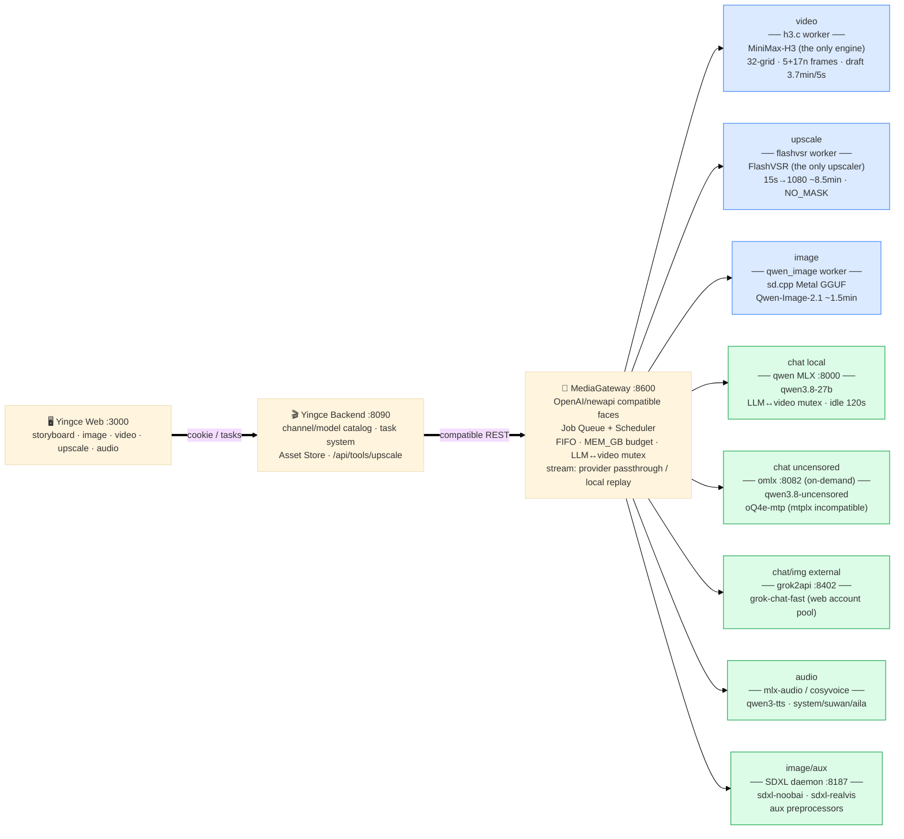

# AI Media Gateway

A local AI media generation gateway for Apple Silicon (built on a Mac M5 Pro 48GB).
It sits between a director frontend ([影策 / open-ai-canvas](https://github.com/ddcat-ai/open-ai-canvas))
and a set of local inference engines, exposing one unified async job API.

**中文文档:[README.zh-CN.md](README.zh-CN.md)** · **Architecture diagram:[docs/architecture.md](docs/architecture.md)**



## Engines

| Worker | Engine | Output | Notes |
|---|---|---|---|
| `video` | [h3.c](https://github.com/antirez/h3.c) MiniMax-H3 (Metal) | MP4 | T2V/I2V/FL2VA/Ref2VA (audio-conditioned lip sync); 32-multiple grid, 5+17n frames, 768×1344 cap; 15s single-render verified |
| `upscale` | [FlashVSR](https://github.com/OpenImagingLab/FlashVSR) v1.1 tiny (our MPS port) | MP4 | the only upscaler: 15s→1080p ~8.5min, zero identity drift; NO_MASK recipe + 128-multiple rule |
| `qwen_image` | [Qwen-Image-2.1](https://huggingface.co/Qwen/Qwen-Image-2.1) 7B via [stable-diffusion.cpp](https://github.com/leejet/stable-diffusion.cpp) (Metal GGUF) | PNG | primary image engine: ~1.5min/512², strong CJK text rendering |
| `voice` | CosyVoice (zero-shot clones, single model multi-voice) | WAV | voice registry `vendor/cosyvoice/voices.json`: system (default) / suwan / aila |
| `tts_qwen` | Qwen3-TTS 1.7B via [mlx-audio](https://github.com/Blaizzy/mlx-audio) | WAV | second voice engine |
| `music` | ACE-Step 1.5 | WAV | instrumental / lyrics |
| `shot` | composite: image → voice → video → music → mux | MP4 | draft / quality profiles, h3 audio muted, TTS original laid back; image stage now runs on Qwen-Image-2.1 |
| `mix` | FFmpeg | MP4 | SFX/voice tracks onto video — `sfx_tag` picks from a curated 40+-tag library (wind, rain, explosion, thunder, sword clash, footsteps, magic…) |
| `concat` / `noop` | FFmpeg | MP4 | multi-shot stitch with per-segment music bed |

Retired: iris-image (FLUX.2 Klein, model directory lost — recoverable by re-downloading), SeedVR2, LTX-2.5 (code deleted, see git history).

## Highlights

- **Unified job API** — `POST /v1/jobs` + `GET /v1/jobs/{id}` + cooperative cancel;
  everything lands in `assets/{job_id}/`.
- **OpenAI-compatible faces** for a director frontend:
  `POST /v1/videos` (Sora-style multipart, incl. cancel + reconciliation),
  `POST /v1/images/generations` and `/v1/images/edits`,
  `POST /v1/audio/speech`,
  `POST /v1/chat/completions` (three chat routes — local qwen3.8-27B MLX, omlx
  uncensored variant, grok2api — mutexed with video jobs),
  `GET /v1/models`.
- **Video upscale** — `POST /v1/upscale` → FlashVSR (the only upscaler):
  15s→1080p ~8.5min wall clock, zero identity drift; NO_MASK dense attention
  (1.8× faster and more stable than the sparse path).
- **Memory-budget scheduler** — 40 GB budget; the 19 GB LLM and the 35 GB video
  engine are mutually exclusive and unload each other automatically.
- **Use-then-release lifecycle** — engines close after each job (`keep_loaded`
  opts out); TTS/LLM/omlx servers spawn on demand (bare-socket health probe —
  never urllib, macOS system proxies hijack localhost probes) and idle-exit.
- **Benchmark-driven video profiles** (M5 Pro measured, 864×480 / 120 frames):

| Profile | Config | Wall time | vs reference |
|---|---|---:|---:|
| `reference` | 20 steps / 50 layers / reuse 1 | 1291 s | 1× |
| `quality` | 20 steps / 45 layers / core-reuse 4 / token reduction | **280 s** | **4.6×** |
| `standard` | 6 steps / 45 layers / reuse 1 | 340 s | 3.8× |
| `draft` | + internal canvas 576×320 | **110 s** | **11.7×** |

  INT8 FC2 measured **zero gain** on M5 Pro and is excluded from profiles.
- **Sound effects** — curated SFX library (`assets/sfx/<tag>/`, 40+ tags with
  manifest and sources: ambience wind/rain/crowd, explosion, thunder, melee,
  footsteps, UI/magic…) mixed via the `mix` worker or `/v1/mix`; ambient beds
  can also be generated through the music engine.

## Quick start

```bash
python3 -m venv .venv
.venv/bin/pip install fastapi "uvicorn[standard]" httpx python-multipart

# engines are expected under /Users/<you>/tool (see docs/tools.md);
# paths are overridable per worker via env vars (SDCPP_HOME, FLASHVSR_HOME,
# H3C_LIBRARY, COSYVOICE_DIR, ...)

.venv/bin/uvicorn server.main:app --host 127.0.0.1 --port 8600
```

Run tests (no GPU needed, engines are mocked):

```bash
for t in tests/test_*.py; do .venv/bin/python "$t"; done
```

Environment: `MG_DB`, `MG_ASSETS`, `MG_BUDGET_GB` (default 40), plus per-worker
overrides documented in `server/workers/*.py` module docstrings.

## Repo layout

```text
server/
  main.py            FastAPI app, generic job API
  core.py            scheduler (memory budget, priorities, cooperative cancel),
                     SQLite store, worker auto-discovery contract
  compat_h3cweb.py   Sora-style video face (newapi protocol)
  compat_openai.py   OpenAI image / audio / music faces (qwen-image / sdxl / aux)
  compat_chat.py     OpenAI chat face → local MLX / omlx / grok2api (streaming)
  llm.py             local qwen MLX server lifecycle (spawn / idle-exit / unload)
  workers/           video | upscale(flashvsr) | qwen_image | voice | tts_qwen |
                     music | shot | mix | concat | _util(shared subprocess helpers)
vendor/h3_bridge.py  ctypes FFI for libh3.dylib
vendor/cosyvoice/    cosyvoice client + voices.json (system/suwan/aila voices)
scripts/             deploy_config.py (launchd plist) · cutover.py · h3_bench.py
docs/                plan.md · tools.md (engine inventory) · architecture.md (+png)
```

## Related

- [MediaGateway_YingCe](https://github.com/ouyexiaogongzhu/MediaGateway_YingCe) —
  our director-side companion: a fork of [影策 / open-ai-canvas](https://github.com/ddcat-ai/open-ai-canvas)
  (AI film & drama creation workbench) wired to this gateway. It renders storyboards
  through this gateway's shot pipeline — draft/quality profiles, TTS-driven lip sync,
  BGM mixing — and manages projects, characters, scenes and the novel-to-storyboard
  skill chain. Run it on :8090 (Go) + :3000 (React) alongside this gateway.
- [antirez/h3.c](https://github.com/antirez/h3.c) — the video engine and the
  ctypes bridge source.
- [OpenImagingLab/FlashVSR](https://github.com/OpenImagingLab/FlashVSR) — the
  upscaling engine (our MPS port lives at
  [ouyexiaogongzhu/FlashVSR-mps](https://github.com/ouyexiaogongzhu/FlashVSR-mps)).
- [leejet/stable-diffusion.cpp](https://github.com/leejet/stable-diffusion.cpp) —
  the image engine runtime (Qwen-Image-2.1 day-0 support).
