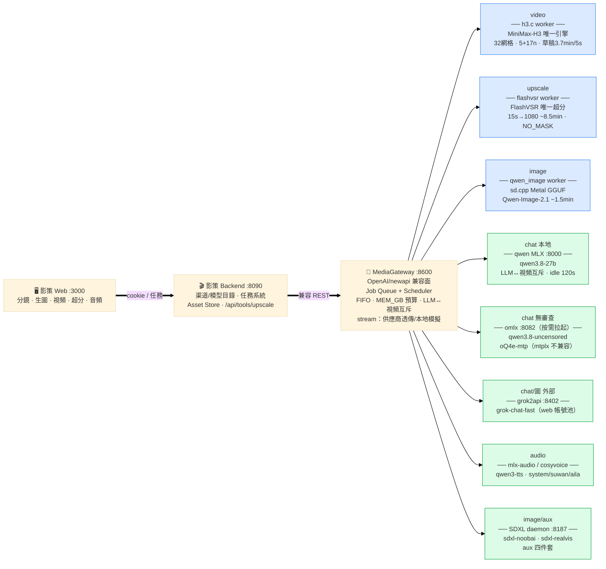

# AI Media Gateway(本地 AI 媒体网关)

[English](README.md)

跑在 Apple Silicon(Mac M5 Pro 48GB)上的本地 AI 媒体生成网关。位于导演前端
([影策 / open-ai-canvas](https://github.com/ddcat-ai/open-ai-canvas))与一组本地推理引擎之间,
对外暴露统一的异步任务 API。

**架构图:[docs/architecture.md](docs/architecture.md)**



## 引擎

| Worker | 引擎 | 产物 | 说明 |
|---|---|---|---|
| `video` | [h3.c](https://github.com/antirez/h3.c) MiniMax-H3(Metal) | MP4 | T2V/I2V/FL2VA/Ref2VA(音频条件口型对齐);32 网格、帧 5+17n、画幅上限 768×1344;15s 单渲染已验证 |
| `upscale` | [FlashVSR](https://github.com/OpenImagingLab/FlashVSR) v1.1 tiny(MPS 移植) | MP4 | 唯一超分:15s→1080p ~8.5min、零身份漂移;NO_MASK 配方 + 128 倍数规则 |
| `qwen_image` | [Qwen-Image-2.1](https://huggingface.co/Qwen/Qwen-Image-2.1) 7B([stable-diffusion.cpp](https://github.com/leejet/stable-diffusion.cpp) Metal GGUF) | PNG | 生图主引擎:~1.5min/512²,中文文本渲染强项 |
| `voice` | CosyVoice(零样本克隆,单模型多音色) | WAV | 音色库 `vendor/cosyvoice/voices.json`:system(默认)/suwan/aila |
| `tts_qwen` | Qwen3-TTS 1.7B([mlx-audio](https://github.com/Blaizzy/mlx-audio)) | WAV | 第二声音引擎 |
| `music` | ACE-Step 1.5 | WAV | 纯音乐/歌词歌曲 |
| `shot` | 组合:image → voice → video → music → 混音 | MP4 | 草稿/成片两档,h3 音轨静音、铺 TTS 原声;image 阶段已改走 Qwen-Image-2.1 |
| `mix` | FFmpeg | MP4 | 音效/台词轨混上视频——`sfx_tag` 从 40+ 标签的精选音效库随机选取(风/雨/爆炸/雷/刀剑/脚步/魔法…) |
| `concat` / `noop` | FFmpeg | MP4 | 多镜头拼接 + 分段配乐垫底 |

已退役:iris-image(FLUX.2 Klein,模型目录失踪,重下可恢复)、SeedVR2、LTX-2.5(代码已删,见 git 历史)。

## 特性

- **统一任务 API** — `POST /v1/jobs` + `GET /v1/jobs/{id}` + 协作式取消;
  所有产物落 `assets/{job_id}/`。
- **OpenAI 兼容协议面**(供导演前端直连):
  `POST /v1/videos`(Sora 风格 multipart,含取消与对账)、
  `POST /v1/images/generations` 与 `/v1/images/edits`、
  `POST /v1/audio/speech`、
  `POST /v1/chat/completions`(本地 qwen3.8-27B MLX、omlx 无审查变体、grok2api 三路,与视频任务内存互斥)、
  `GET /v1/models`。
- **视频超分** — `POST /v1/upscale` → FlashVSR(唯一超分):15s→1080p ~8.5min、
  零身份漂移;NO_MASK 稠密注意力(比 sparse 路径快 1.8× 且更稳)。
- **内存预算调度** — 预算 40GB;19GB 的 LLM 与 35GB 的视频引擎互斥,自动互相卸载。
- **用完即关生命周期** — 引擎每单结束即释放(`keep_loaded` 可选常驻);
  TTS/LLM/omlx 服务按需拉起(裸 socket 探活+spawn,勿用 urllib——macOS 系统代理会
  劫持 localhost 探活)、空闲自动退出。
- **基准驱动的视频 profile**(M5 Pro 实测,864×480 / 120 帧):

| Profile | 配置 | 耗时 | 相对基准 |
|---|---|---:|---:|
| `reference` | 20 步 / 50 层 / reuse 1 | 1291s | 1× |
| `quality` | 20 步 / 45 层 / core-reuse 4 / token reduction | **280s** | **4.6×** |
| `standard` | 6 步 / 45 层 / reuse 1 | 340s | 3.8× |
| `draft` | + internal canvas 576×320 | **110s** | **11.7×** |

  INT8 FC2 在 M5 Pro 实测零收益,已从 profile 剔除。
- **音效库** — 精选 SFX 库(`assets/sfx/<tag>/`,40+ 标签,含 manifest 与来源:
  环境风/雨/人群、爆炸、雷、刀剑、脚步、UI/魔法…),经 `mix` worker 或
  `/v1/mix` 混入视频;氛围类声音也可由音乐引擎生成。

## 快速开始

```bash
python3 -m venv .venv
.venv/bin/pip install fastapi "uvicorn[standard]" httpx python-multipart

# 推理引擎约定放在 /Users/<you>/tool(见 docs/tools.md);
# 各 worker 均有环境变量可覆盖路径(SDCPP_HOME、FLASHVSR_HOME、H3C_LIBRARY、COSYVOICE_DIR 等)

.venv/bin/uvicorn server.main:app --host 127.0.0.1 --port 8600
```

跑测试(引擎全部 mock,无需 GPU):

```bash
for t in tests/test_*.py; do .venv/bin/python "$t"; done
```

环境变量:`MG_DB`、`MG_ASSETS`、`MG_BUDGET_GB`(默认 40),各 worker 的覆盖项见
`server/workers/*.py` 模块 docstring。

## 仓库结构

```text
server/
  main.py            FastAPI 应用,通用任务 API
  core.py            调度器(内存预算/优先级/协作取消)、SQLite、worker 自动发现契约
  compat_h3cweb.py   Sora 风格视频协议面(newapi)
  compat_openai.py   OpenAI 图像/音频/音乐协议面(qwen-image / sdxl / aux)
  compat_chat.py     OpenAI chat 协议面 → 本地 MLX / omlx / grok2api 三路(含流式)
  render.py          FFmpeg 封装:混音(台词+BGM,静音源音轨)、拼接、定格
  llm.py             本地 qwen MLX server 生命周期(按需拉起/空闲退出/卸载)
  workers/           video | upscale(flashvsr) | qwen_image | voice | tts_qwen |
                     music | shot | mix | concat | _util(共享子进程助手)
vendor/h3_bridge.py  libh3.dylib 的 ctypes FFI
vendor/cosyvoice/    cosyvoice client + voices.json(system/suwan/aila 音色库)
scripts/             deploy_config.py(launchd plist)· cutover.py · h3_bench.py
docs/                plan.md · tools.md(引擎实测)· architecture.md(+png)
```

## 相关仓库

- [MediaGateway_YingCe](https://github.com/ouyexiaogongzhu/MediaGateway_YingCe) —
  导演侧配套仓库:[影策 / open-ai-canvas](https://github.com/ddcat-ai/open-ai-canvas)
  (AI 影视短剧创作工作台)的 fork,已接入本网关。分镜经本网关的 shot 流水线渲染——
  草稿/成片双档、TTS 口型对齐、BGM 混音;同时管理项目/角色/场景与小说转分镜技能链。
  与本网关配套运行::8090(Go 后端)+ :3000(React 前端)。
- [antirez/h3.c](https://github.com/antirez/h3.c) — 视频引擎及 ctypes bridge 来源
- [OpenImagingLab/FlashVSR](https://github.com/OpenImagingLab/FlashVSR) —
  超分引擎(我们的 MPS 移植在
  [ouyexiaogongzhu/FlashVSR-mps](https://github.com/ouyexiaogongzhu/FlashVSR-mps))
- [leejet/stable-diffusion.cpp](https://github.com/leejet/stable-diffusion.cpp) —
  生图引擎运行时(Qwen-Image-2.1 day-0 支持)
