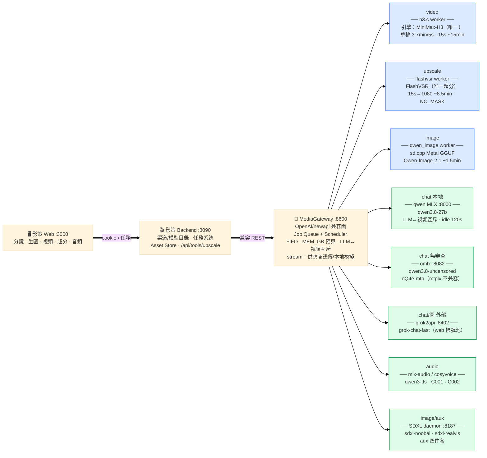

# 影策系統架構（2026-09-28）

> 按 Worker 分流：畫布 → 影策 → Gateway（兼容面 → Queue）→ 7 個 Worker → 各自的引擎/模型。
> qwen3.6-27b 已刪除；iris-image 已停用（被 qwen-image 頂替）；chatgpt2api 停用待帳號。

**常駐守護運維**：omlx（run-aeon.sh）/ SDXL daemon 無 launchd——重啟機器後手動拉起；
grok2api 有 launchd；qwen MLX :8000 由 Gateway llm.py 按需拉起。
**已棄用**：qwen3.6-27b（刪除）、iris-image（enabled=0，重下 flux-klein-9b 可恢復）、chatgpt2api（待帳號）、SeedVR2/LTX（已刪）。
