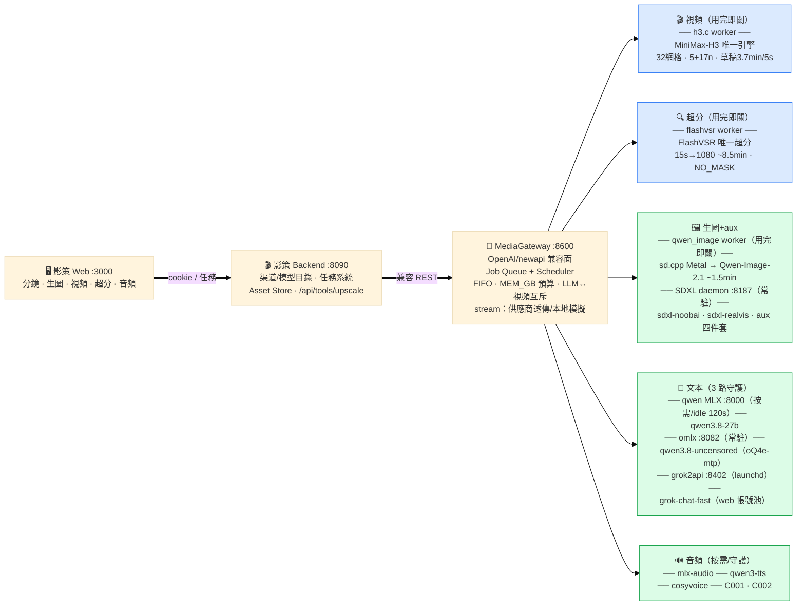

# 影策系統架構（2026-09-28）

> 按功能合併：畫布 → 影策 → Gateway → 5 大能力域，每域列舉 worker/守護與模型。
> 已棄用：qwen3.6-27b（刪除）、iris-image（停用）、chatgpt2api（停用待帳號）、SeedVR2/LTX（刪除）。

**分流明細**：/v1/videos→h3.c｜/v1/upscale→FlashVSR｜/v1/images qwen-image*→sd.cpp、
sdxl*→SDXL daemon｜/v1/chat qwen3.8-27b→MLX、qwen3.8-uncensored→omlx（名稱重寫）、grok*→grok2api｜
/v1/audio qwen3-tts→mlx-audio、C001/C002→cosyvoice

**已棄用**：iris-image（enabled=0，重下 flux-klein-9b 可恢復）、qwen3.6-27b、chatgpt2api（待帳號）、SeedVR2/LTX
