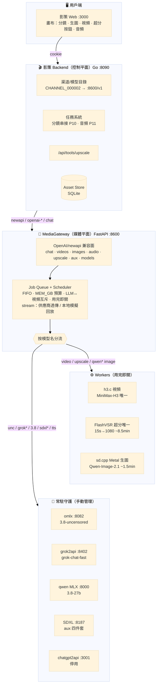

# 影策系統架構（2026-09-28）

> 四層：畫布 → 影策控制平面 → Gateway 媒體平面 → 引擎。qwen3.6-27b 已刪除（模型已棄用）。

**分流明細**：video→h3.c｜upscale→FlashVSR｜qwen* image→sd.cpp｜sdxl*/aux→SDXL daemon｜
qwen3.8-uncensored→omlx :8082（模型名重寫為目錄全名）｜grok*→grok2api｜qwen3.8-27b→本地 MLX :8000

**引擎備註**：qwen3.6-27b 已刪除（2026-09-28，模型棄用）；iris.c 已停用（flux-klein-9b 目錄失蹤，
重下 ~30GB 可恢復）；chatgpt2api 停用待帳號；omlx / SDXL daemon 無 launchd，重啟機器後手動拉起
